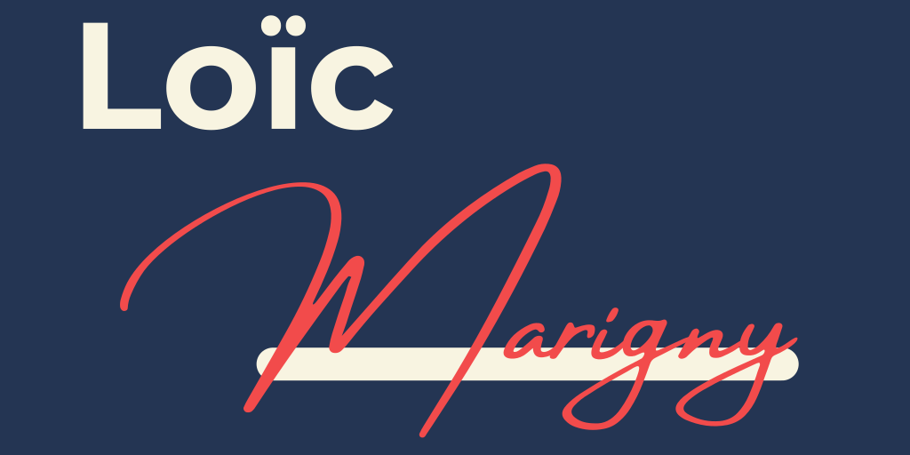

# Loïc MARIGNY
## Welcome to my GitHub profile 👋

I'm a student in last year of **engineering school** at [ESILV](https://esilv.fr/). I work as a junior consultant at [Enedis](https://www.enedis.fr/) as well, and I'm currently on an abroad semester in *Riga, Latvia*.
I'm passionate about **literature, politics and learning other languages.** I'd like to become a developer, you can find my projects and my progress here.
I code in **Python, C#, TypeScript** and I'm trying to get better with web development tools !
You can reach me on LinkedIn :  [Loïc Marigny](https://www.linkedin.com/in/loic-marigny/), or on my other socials linked to my profile.

<!--
**loic-marigny/loic-marigny** is a ✨ _special_ ✨ repository because its `README.md` (this file) appears on your GitHub profile.

Here are some ideas to get you started:

- 🔭 I’m currently working on ...
- 🌱 I’m currently learning ...
- 👯 I’m looking to collaborate on ...
- 🤔 I’m looking for help with ...
- 💬 Ask me about ...
- 📫 How to reach me: ...
- 😄 Pronouns: ...
- ⚡ Fun fact: ...
-->
